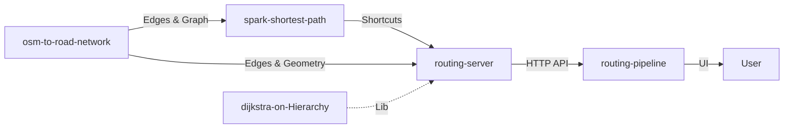

# Hierarchical Routing Pipeline

A complete end-to-end pipeline for building and querying Contraction Hierarchies on OpenStreetMap road networks with H3 geospatial indexing.

## 🎯 Overview

This pipeline transforms raw OpenStreetMap data into a production-ready shortest-path query system. It consists of **four core projects** that work together:



## 📦 Project Components

| Stage | Project | Description | Tech Stack |
|-------|---------|-------------|------------|
| 1 | [osm-to-road-network](https://github.com/khoshkhah/osm-to-road-network) | **Extraction**: Converts OSM data to road network with H3 indexing. | Python, OSMnx |
| 2 | [spark-shortest-path](https://github.com/khoshkhah/spark-shortest-path) | **Preprocessing**: Builds Contraction Hierarchy shortcuts at scale. | PySpark, GraphFrames |
| 3 | [dijkstra-on-Hierarchy](https://github.com/khoshkhah/dijkstra-on-Hierarchy) | **Core Algorithm**: The C++ library implementing CH routing logic. | C++20 |
| 4 | [routing-server](https://github.com/khoshkhah/routing-server) | **Serving**: High-performance HTTP server hosting the routing engine. | C++, Crow, Boost |
| App | [routing-pipeline](./) | **Application**: Python API Gateway and Streamlit UI. | FastAPI, Streamlit |

## 🚀 Quick Start

### Prerequisites

- Python 3.10+
- Apache Spark 3.x (for Stage 2)
- C++20 compiler, CMake, Arrow/Parquet, libh3 (for Stage 3)

### Step 1: Extract Road Network

```bash
git clone https://github.com/khoshkhah/osm-to-road-network.git
cd osm-to-road-network
pip install -r requirements.txt

python scripts/create_network.py --region Kentucky --district Somerset --output data/output
```

**Output:**
- `Somerset_driving_simplified_edges_with_h3.csv` - Road edges with H3 cells
- `Somerset_driving_edge_graph.csv` - Edge connectivity (turn-aware)

### Step 2: Build Contraction Hierarchy

```bash
git clone https://github.com/khoshkhah/spark-shortest-path.git
cd spark-shortest-path
pip install -r requirements.txt

python src/shortest_path_hybrid.py \
    --edges ../osm-to-road-network/data/output/Somerset_driving_simplified_edges_with_h3.csv \
    --graph ../osm-to-road-network/data/output/Somerset_driving_edge_graph.csv \
    --output output/shortcuts.parquet
```

**Output:**
- `shortcuts.parquet` - Contraction Hierarchy shortcuts with via_edge for expansion

### Step 3: Build Core Library

```bash
git clone https://github.com/khoshkhah/dijkstra-on-Hierarchy.git
cd dijkstra-on-Hierarchy
./build_cpp.sh
```

### Step 4: Start Routing Server

```bash
git clone https://github.com/khoshkhah/routing-server.git
cd routing-server

# Build and Run
./scripts/build.sh
./scripts/run.sh
# Server starts on localhost:8080
```

### Step 5: Start API Gateway

Open a new terminal:

```bash
cd routing-pipeline

# Create/Activate venv
python -m venv venv
source venv/bin/activate

# Install dependencies
pip install -r api/requirements.txt
pip install -r app/requirements.txt

# Run API
python -m uvicorn api.server:app --host 0.0.0.0 --port 8000
```

### Step 6: Start Web UI

Open another terminal:

```bash
cd routing-pipeline
source venv/bin/activate

# Run Streamlit
streamlit run app/streamlit_app.py
```

## 📊 Data Flow

### Alternative: Using Shell Scripts

Scripts are available in `scripts/` directory:

```bash
# Terminal 1: API
./scripts/start_api.sh

# Terminal 2: UI
./scripts/start_streamlit.sh
```

### Usage

1. Open http://localhost:8501
2. Select a dataset
3. Click map start/end points
4. Click "Compute Route"

### Features

- ✅ **Interactive Map**: Folium-based OpenStreetMap with click-to-select
- ✅ **Search Modes**:
    - **One-to-One**: Optimized bidirectional Dijkstra for point-to-point queries
    - **KNN / Radius**: Multi-source multi-target Dijkstra for area-based queries
- ✅ **H3 Visualization**: Debug layer showing Source (Green), Target (Red), and High (Blue) cells for algorithm verification
- ✅ **Real-Time Routing**: Sub-second path computation using C++ engine
- ✅ **Dynamic Dataset Loading**: Load/Unload datasets on-demand to manage memory
- ✅ **Detailed Metrics**: Granular breakdown of runtime (Search, Expand, GeoJSON)
- ✅ **Cost vs Distance**: Clear distinction between Travel Time (optimization cost) and Physical Distance (km)
- ✅ **Path Visualization**: Expanded base edge path displayed with road metadata
- ✅ **Statistics Dashboard**: Distance, runtime, and path composition
- ✅ **REST API**: Programmatic access to routing functionality


### Configuration

Add new datasets by editing `config/datasets.yaml`:

```yaml
datasets:
  - name: "YourCity"
    shortcuts_path: "/path/to/shortcuts.parquet"
    edges_path: "/path/to/edges_with_h3.csv"
    binary_path: "/path/to/shortcut_router"
    description: "Your City Description"
```

**Required files:**
- **Shortcuts**: Parquet directory from `spark-shortest-path` (Stage 2)
- **Edges**: CSV file from `osm-to-road-network` (Stage 1) with `id`, `geometry` (WKT), `length`, `highway` columns
- **Binary**: Compiled C++ query engine from `dijkstra-on-Hierarchy` (Stage 3)

### API Endpoints

The FastAPI backend provides the following endpoints:

| Endpoint | Method | Description |
|----------|--------|-------------|
| `/` | GET | API information and health check |
| `/datasets` | GET | List available datasets with bounds |
| `/load-dataset` | POST | Load a dataset into memory |
| `/unload-dataset` | POST | Unload a dataset from memory |
| `/server-status` | GET | Check C++ server connection and loaded datasets |
| `/nearest-edge` | GET | Find nearest edge to lat/lon coordinates |
| `/route` | GET | Compute shortest path between two points |

### Technology Stack

- **Frontend**: Streamlit, Folium (Leaflet.js wrapper)
- **Backend**: FastAPI, Uvicorn
- **Spatial**: Shapely, RTree (libspatialindex)
- **Data Processing**: Pandas, PyYAML
- **Query Engine**: C++20, Apache Arrow/Parquet, libh3

### Troubleshooting

### Troubleshooting

**C++ Binary Not Found:**
```bash
cd ../dijkstra-on-Hierarchy
./build_cpp.sh
```

**Dataset Loading Errors:**
```bash
# Verify paths in config/datasets.yaml exist
ls -l /path/to/shortcuts.parquet
ls -l /path/to/edges.csv
```

**API Connection Issues:**
- Ensure API is running on port 8000
- Check firewall settings
- Verify `API_BASE_URL` in Streamlit app

**Port Already in Use:**
```bash
# Change ports in docker-compose.yml or startup scripts
# API: default 8000
# Streamlit: default 8501
```

---

## 📊 Data Flow

```
OpenStreetMap PBF
       │
       ▼
┌──────────────────────────────────────────────────────────────┐
│                    osm-to-road-network                       │
│  • Parse OSM ways and nodes                                  │
│  • Build road graph with osmnx                               │
│  • Apply turn restrictions from OSM relations                │
│  • Assign H3 cells (resolution 15) to nodes                  │
│  • Compute LCA resolution for edge pairs                     │
│  • Calculate travel costs from length/speed                  │
└──────────────────────────────────────────────────────────────┘
       │
       │  edges_with_h3.csv, edge_graph.csv
       ▼
┌──────────────────────────────────────────────────────────────┐
│                    spark-shortest-path                       │
│  • Partition graph by H3 cells                               │
│  • Compute all-pairs shortest paths per partition            │
│  • Build shortcuts with via_edge for path expansion          │
│  • Assign hierarchy direction (inside: +1, 0, -1)            │
│  • Output as Parquet with H3 cell annotations                │
└──────────────────────────────────────────────────────────────┘
       │
       │  shortcuts.parquet
       ▼
┌──────────────────────────────────────────────────────────────┐
│                   dijkstra-on-Hierarchy                      │
│  • Load shortcuts via Apache Arrow (zero-copy)               │
│  • Build forward/backward adjacency lists                    │
│  • Hierarchy-aware bidirectional Dijkstra                    │
│  • Expand shortcuts to base edges via via_edge               │
│  • Sub-millisecond query latency                             │
└──────────────────────────────────────────────────────────────┘
       │
       ▼
   Query Results
   (distance, path, expanded_path)
```

## 🔑 Key Features

### H3 Geospatial Hierarchy
All three stages use Uber's H3 hexagonal indexing system:
- **Stage 1**: Assigns H3 cells to road network nodes
- **Stage 2**: Partitions computation by H3 cells for parallelism
- **Stage 3**: Uses H3 ancestry for hierarchy-aware search pruning

### Turn Restrictions
Unlike basic OSM converters, this pipeline explicitly handles turn restrictions:
- Parses OSM relations (`no_left_turn`, `no_u_turn`, etc.)
- Builds an edge-to-edge connectivity graph (dual graph)
- Routes never suggest illegal turns

### Contraction Hierarchy
The preprocessing stage builds a CH that enables:
- Forward search: only expands upward shortcuts (`inside == +1`)
- Backward search: only expands downward shortcuts (`inside == -1`)
- Meeting in the middle: optimal path reconstruction

### Path Expansion
Shortcuts can be recursively expanded to base edges:
- Each shortcut stores `via_edge` for intermediate edge
- Query engine unpacks `(u, v)` → `(u, via_edge) + (via_edge, v)`
- Returns both shortcut path and fully expanded base-edge path

## 📄 License

Each repository is independently licensed. See individual repositories for details.

## 🤝 Contributing

Contributions are welcome! Please submit issues and pull requests to the relevant repository.

## 👤 Author

[Kaveh Khoshkhah](https://github.com/khoshkhah)
