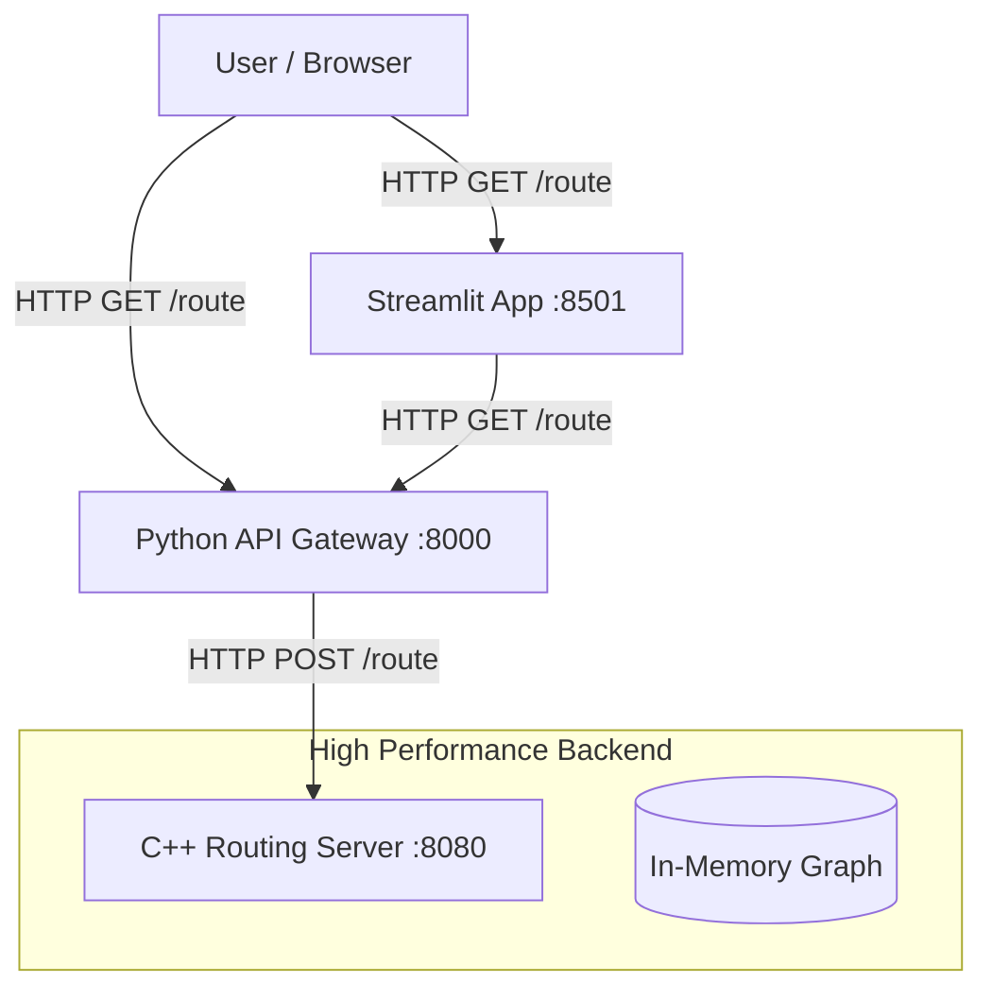

# System Architecture

The Routing Pipeline has been upgraded to a hybrid C++/Python architecture to maximize performance while maintaining ease of use.

## Overview

The system consists of three main components:

1.  **Routing Server (C++)**: High-performance backend engine.
2.  **API Gateway (Python)**: REST API handling client requests and dataset management.
3.  **Frontend (Streamlit)**: Interactive UI for visualization.

## Components

### 1. C++ Routing Server (`routing-server`)
Located in `../routing-server`.
*   **Role**: Handles the heavy lifting of pathfinding.
*   **Tech**: C++20, Boost.Geometry, Crow (HTTP), Contraction Hierarchies.
*   **Performance**: Sub-millisecond routing queries.
*   **Port**: `8080` (Internal).

### 2. Python API Gateway (`routing-pipeline/api`)
Located in `api/`.
*   **Role**: Public-facing API, request validation, response formatting (GeoJSON).
*   **Tech**: FastAPI, Uvicorn.
*   **Port**: `8000` (Public).
*   **Endpoints**:
    *   `GET /route`: Proxies requests to the C++ backend.
    *   `GET /datasets`: Lists available datasets.

### 3. Streamlit Frontend (`routing-pipeline/app`)
Located in `app/`.
*   **Role**: Visual testing and demonstration.
*   **Tech**: Streamlit, Folium (Leaflet).
*   **Port**: `8501`.

## Data Flow

1.  **Request**: User requests a route from A to B.
2.  **Gateway**: Python API receives the request (lat/lon).
3.  **Backend**: API forwards the request to C++ Server.
4.  **Compute**:
    *   C++ Server uses R-tree to map lat/lon to nearest graph edges.
    *   Runs bidirectional Dijkstra on the Contraction Hierarchy.
    *   Unpacks shortcuts to full geometry.
5.  **Response**: C++ Server returns JSON with distance and path.
6.  **Display**: Python API wraps this in GeoJSON for the frontend.

## Setup

See the main `README.md` for startup instructions.
